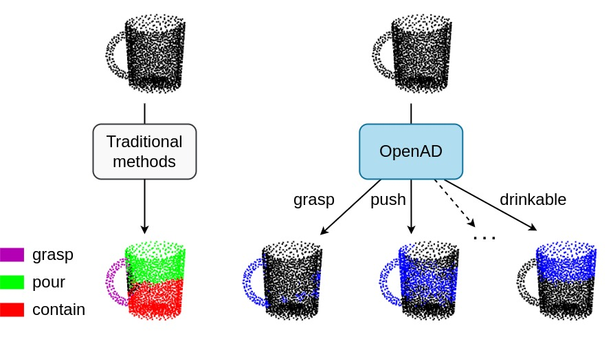
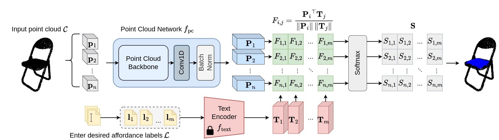

# [IROS 2023] Open-Vocabulary Affordance Detection in 3D Point Clouds

Official code for the IROS 2023 paper "Open-Vocabulary Affordance Detection in 3D Point Clouds".

😊😊😊 Our paper is nominated for the [Best Overall and Best Student Paper Awards](https://ieee-iros.org/iros-2023-award-winners/). 😊😊😊

Our paper is currently available at [this URL](https://ieeexplore.ieee.org/document/10341553?signout=success). More information can be accessed via [our project page](https://openad2023.github.io).



We present OpenAD for a new task of open-vocabulary affordance detection in 3D point clouds. Different from traditional method that are restricted to a predefined affordance label set, OpenAD can detect unlimited affordances conveyed through the form of natural language.


Our key idea is to learn collaboratively the mapping between the language labels and the visual features of the point cloud.


## Getting Started
We strongly encourage you to create a separate CONDA environment.
```
conda create -n openad python=3.8
conda activate openad
conda install pytorch pytorch-cuda=11.6 -c pytorch -c nvidia
conda install pip
pip install -r requirements.txt
```

## Data
Download data from [this drive folder](https://drive.google.com/drive/folders/1f-_V_iA6POMYlBe2byuplJfdKmV72BHu?usp=sharing).

Currently, we support 2 models (OpenAD with backbones of [PointNet++](https://proceedings.neurips.cc/paper/2017/file/d8bf84be3800d12f74d8b05e9b89836f-Paper.pdf) and [DGCNN](https://dl.acm.org/doi/pdf/10.1145/3326362)) and 2 settings (full-shape and partial-view).

## Training
Please train the model on a single GPU for the best performance. Below are the steps for training the model with PointNet++ backbone on the full-shape setting, those of other combinations are equivalent.

* In ```config/openad_pn2/full_shape_cfg.py```, change the value of ```data_root``` to your downloaded data folder, and change the path to class weights to the path of the file ```full_shape_weights.npy``` (contained in the data folder).
* Assume you use the GPU 0, then run the following command to start training:

		CUDA_VISIBLE_DEVICES=0 python3 train.py --config ./config/openad_pn2/full_shape_cfg.py --work_dir ./log/openad_pn2/OPENAD_PN2_FULL_SHAPE_Release/ --gpu 0

## Open-Vocabulary Testing
The followings are steps for open-vocabulary testing a trained model with PointNet++ backbone on the full-shape setting, those of other combinations are equivalent.

* Change the value of ```data_root``` in ```config/openad_pn2/full_shape_open_vocab_cfg.py``` to your downloaded data folder.
* Run the following command:

		CUDA_VISIBLE_DEVICES=0 python3 test_open_vocab.py --config ./config/openad_pn2/full_shape_open_vocab_cfg.py --checkpoint <path to your checkpoint model> --gpu 0
	Where ```<path to your checkpoint model>``` is your traiend model.


## Citation

If you find our work useful for your research, please cite:
```
@inproceedings{Nguyen2023open,
      title={Open-vocabulary affordance detection in 3d point clouds},
      author={Nguyen, Toan and Vu, Minh Nhat and Vuong, An and Nguyen, Dzung and Vo, Thieu and Le, Ngan and Nguyen, Anh},
      booktitle = IROS,
      year      = {2023}
```
